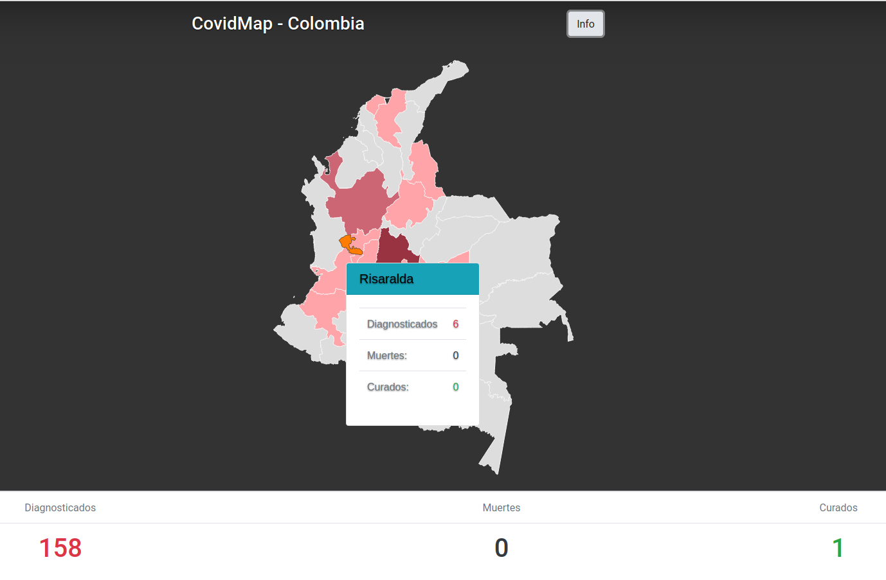

# covidmap-col

- Mapa interactivo de Colombia por regiones con los casos de Covid-19.
- Este mapa interactivo esta desarrollado única y exclusivamente con fines informativos.
- La datos aquí suministrados han sido obtenidos de los reportes entregados por el Ministerio de Salud de Colombia a través de su cuenta oficial de twitter [https://twitter.com/MinSaludCol](@MinSaludCol), y de la cuenta oficial del Instituto Nacional de Salud [https://twitter.com/INSColombia](@INSColombia).

#Última actualización de datos:
- sáb 21 mar 2020 - 00:30

#Recursos utilizados:
- [https://getbootstrap.com/] (https://getbootstrap.com/)
- [https://datamaps.github.io/] (https://datamaps.github.io/)

#Licencia
- CovidMap - Colombia v0.1
- Copyright 2020 Carlos Gutierrez cgutierrez@utp.edu.co
- Este software está publicado bajo licencia [GNU GENERAL PUBLIC LICENSE Version 3](LICENSE)
